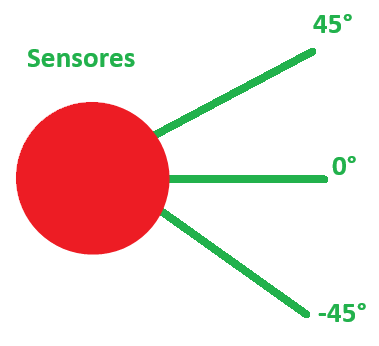
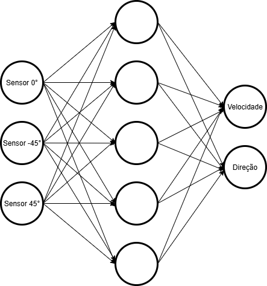
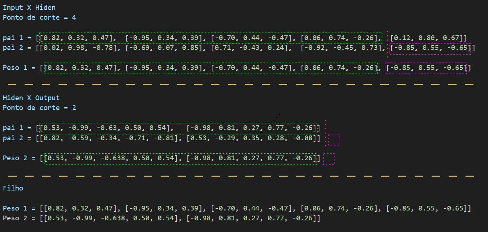
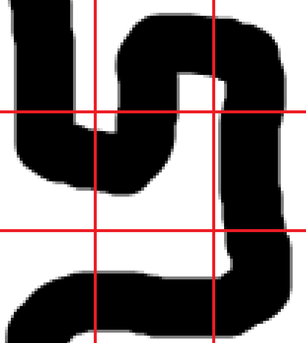
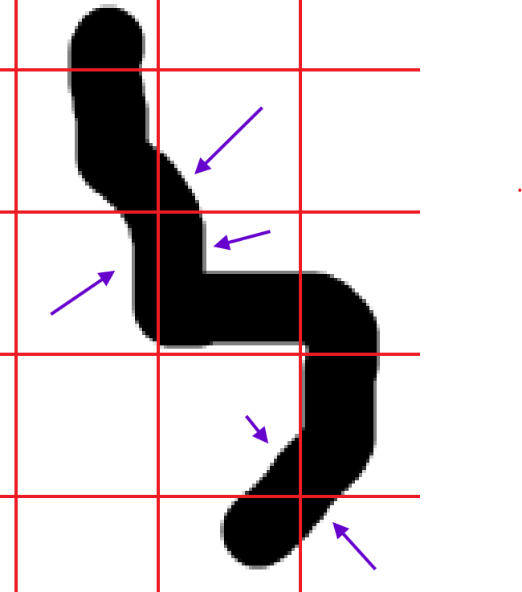

# Corrida Genética

Tech Chalenge 2:  
Projeto de Pós-Graduação da FIAP — Disciplina de Algoritmos Genéticos

## Descrição

Este projeto simula uma corrida de carros autônomos em uma pista, onde cada carro é controlado por uma rede neural simples. Os pesos das redes neurais são evoluídos ao longo das gerações utilizando um **Algoritmo Genético**, permitindo que os carros aprendam a contornar a pista de forma eficiente.

O objetivo é que, ao longo das gerações, os carros consigam completar uma volta na pista, aprimorando seus comportamentos por meio de seleção, cruzamento e mutação dos pesos das redes neurais.

Os carros *não decoram* a pista, eles aprendem a fazer as curvas da melhor forma possível...

## Funcionamento

- **Carros**: Cada carro possui sensores que captam distâncias em três direções (frente, diagonal esquerda e diagonal direita). Com base nessas leituras, a rede neural decide o quanto acelera e para qual lado gira.
- **Rede Neural**: Estrutura simples com 3 entradas (sensores), 1 camada oculta e 2 saídas (aceleração e direção).
- **Algoritmo Genético**:
  - **Elitismo**: Os melhores carros da geração são mantidos.
  - **Eliminação dos fracos**: Os piores são removidos.
  - **Roleta simples**: Seleção dos pais para cruzamento baseada na performance.
  - **Mutação**: Pequenas alterações aleatórias nos pesos dos filhos.
- **pygame**: Lib que usei para controlar todo a simulação.

## Estrutura do Projeto

```
CorridaGenetico/
├── circuitos/             # Apenas as imagens das pistas
├── carro.py               # Lógica do carro e sensores
├── circuito.py            # Lógica da pista e grid
├── algoritmo_genetico.py  # Algoritmo genético
├── main.py                # Loop principal do jogo/simulação
├── neural_network.py      # Implementação da rede neural
├── config.py              # Configurações globais
```

## Requisitos

- Python 3.12+
- pygame

## Como Executar

1. **Clone o repositório**:

   ```zsh
   git clone <url-do-repositorio>
   cd CorridaGenetico
   ```

1. **Instalação das dependências**

   ```zsh
   pip install pygame
   ```

1. **Execute o simulador**:

   ```zsh
   python main.py
   ```

1. **Controles durante a simulação**:
   - `Q`: Encerra a geração atual
   - `G|H`: Alterna a visualização do grid
   - `R|T`: Alterna a visualização do rastro do melhor carro
   - `S|D`: Alterna a visualização dos sensores do melhor carro
   - `0 - 5`: Diminui/Aumenta o delay entre frames (velocidade da simulação)

## Detalhes Técnicos

### Carro e Sensores

- Cada carro é representado por um círculo na tela.
- Os sensores realizam ray-casting em três direções para detectar a distância até a parede da pista.
- As leituras dos sensores são usadas como entrada para a rede neural.  
   

### Rede Neural

- **Entradas**: 3 (sensores que captam as distâncias)
- **Camada oculta**: 5 neurônios
- **Saídas**: 2 (velocidade e direção)
- Os pesos são inicializados aleatoriamente e evoluídos pelo algoritmo genético.  
   

### Algoritmo Genético

1. **Ranqueia os carros**:
   - Ranqueamento ocorre de acordo com a distância total percorrida.
   - Como todos os carros correm no mesmo período, por tabela também está ranqueando o mais rápido.
1. **Elitismo**: 
   - Mantém os 3 melhores carros da geração anterior.
   - Gera 2 filhos com esses pais.
1. **Eliminação dos fracos**: 
   - Elimina os 1/3 mais fracos, sem darlhes a chance de cruzamento.
1. **Cruzamento**: 
   - Esolhe dois pais usando **Roleta Simples** (os melhores tem maior chance de serem esvolhidos).
   - Cruza os genes dos pais usando **Recombinação em Um Ponto**.
   - Como a Rede Neural tem dois grupos de pesos (Input X Hiden e Hiden x Output), a Recombinação ocorre duas vezes, uma para cada grupo.
   - Ex: 

1. **Mutação**: 
   - Sempre que um filho é gerado, cada peso de cada camada da Rede Neural tem chance de 10% de sofrer uma pequena mutação.

1. **Eliminação dos gêmeos**
   - Como tanto o uso do elitismo quanto da roleta privilegiam os mais adaptados, tive o problema de todos os filhos acabarem convergindo para o mesmo resultado e em poucas gerações todos eram gêmeos uns dos outros. Para reoslver isso comecei a elimiar os gêmeos. Qualquer um que tiver os pesos exatamente iguais é eliminado.


## Resultados de Treinamento

Para comprovar que os carros não estão decorando a pista e sim aprendendo a "dirigir", fizemos o seguinte:
1) **(T1)** Deixamos os carros apreenderem a circular a pista "DIFICL" 10 vezes, sem nenhum treinamento prévio e anotamos a quantidade de gerações que eles levaram para dar **uma volta**;
2) Deixamos os carros aprenderem a fazer a pista "INTERLAGOS" e coletamos os pesos de suas redes neurais.
3) Deixamos os carros aprenderem a fazer a pista "DINO" e coletamos os pesos de suas redes neurais.
4) **(T2)** Fizemos o *hot start* da pista "DIFICIL" com os pesos do melhor carro da pista "INTERLAGOS"
5) **(T3)** Fizemos o *hot start* da pista "DIFICIL" com os pesos do melhor carro da pista "DINO"
6) **(T4)** Fizemos o *hot start* da pista "DIFICIL" com os pesos do melhor carro da pista "INTERLAGO" e "DINO"

| Testes    | Sem treinamento (T1)  | Treinado em Interlagos (T2) | Treinado em Dino (T3) | Treinado Interlagos e Dino (T4) |
|-----------|------------------|------------------------|-------------------|----------------------------|
| 1         | 6                | 3                      | 2                 | 2                          |
| 2         | 247              | 5                      | 3                 | 2                          |
| 3         | 8                | 14                     | 2                 | 3                          |
| 4         | 6                | 3                      | 3 (inv)\*\*           | 3                          |
| 5         | > 250\*            | 2                      | 4                 | 3                          |
| 6         | 5                | 2                      | 3                 | 2                          |
| 7         | 198 (inv)\*\*        | 2                      | 3                 | 2                          |
| 8         | 6                | 4                      | 5                 | 2                          |
| 9         | 2                | 3                      | 4                 | 2                          |
| 10        | 6                | 4                      | 3                 | 2                          |
| Médida    | 73 (5.5)         | 4.0                    | 3.2               | 2.5                        |

\* Desliguei pq não parecia que ia terminar (máximo local ??)  
\*\* Fez a pista de forma invertida

Fica bem claro que os carros que "treinaram" em outras pistas conseguem se sair muito melhor na pista "DIFICIL"! Normalmente fechando o cisrcuito em 2 gerações.

## Personalização

- **Configurações**: Ajuste parâmetros em config.py para modificar tamanho da população, taxa de mutação, formato da rede neural, etc.
- **Pistas**: Adicione novas imagens na pasta `circuitos` e altere o código no final do arquivo `circuito.py` para utilizá-las.

### Pistas

- As pistas estão na pasta `circuitos` e podem ser facilmente trocadas ou modificadas. 
- Uma pista é um traçado qualquer que tenha fundo transparente. 
- Se for desenhar uma pista:
   - Grid de 40x40;
   - Caneta de 10 a 20
   - Não deixe o traçado da pista pegar dois "quadradinhos" do grid ao mesmo tempo, isso atrapalhará a contagem

Exemlo de um trecho bem feito:  


Exemplo de um trecho ruim:  

